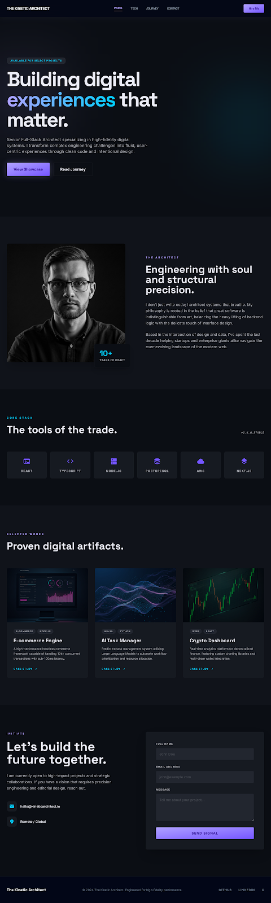

# 🏗️ The Kinetic Architect | Portfolio

> **Engineering with soul and structural precision.**

A high-fidelity, professional portfolio showcasing over 10 years of experience in Full-Stack Architecture. This project features a modern, responsive design built with a focus on performance, aesthetic excellence, and user-centric experience.

## 💎 Project Highlights

- **Modern Tech Stack**: Built using a curated selection of industry-leading tools.
- **Premium Design**: Implementation of professional typography (Inter & Space Grotesk) and a custom dark-mode color palette.
- **Responsive Architecture**: Fully optimized for mobile and desktop experiences using Tailwind CSS.
- **Bento-style Sections**: Clean, modular layout for technical skills and project showcases.

## 🛠️ Built With

## 📂 Core Sections

- **🏛️ The Architect**: A deep dive into the engineering philosophy and professional journey.
- **⚡ Core Stack**: A high-impact visualization of primary technologies including React, TypeScript, Node.js, and AWS.
- **🏺 Selected Works**: A showcase of high-performance digital artifacts:
    - **E-commerce Engine**: High-transaction headless framework.
    - **AI Task Manager**: LLM-driven workflow automation.
    - **Crypto Dashboard**: Real-time DeFi analytics.
- **📡 Initiate**: A streamlined contact interface for strategic collaborations.

## 🚀 Getting Started

To view the portfolio locally:

1. Clone or download the repository.
2. Open `index.html` in any modern web browser.

---

© 2024 The Kinetic Architect. Engineered for high-fidelity performance.
